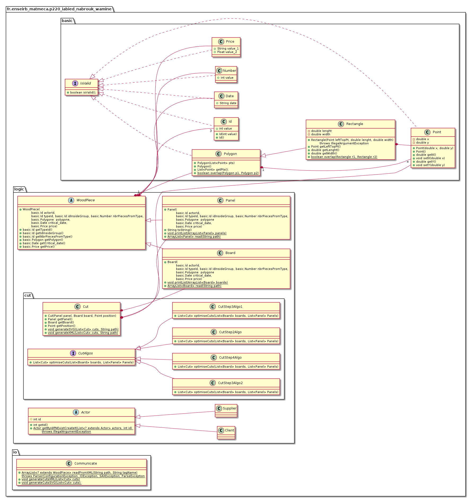

# WoodCutPlanner

Trinôme: Abied Imad, Abrouk Nada, Amine Wiam

Ce projet s'inscrit dans le cadre du cours PG220 (programmation orientée objet, langage JAVA), son but est de développer une application 
de découpe de planches de bois L’entreprise reçoit un ensemble de commandes de clients et
doit découper les différentes planches demandées à partir de grands panneaux de bois achetés 
chez un fournisseur.

Le but est donc d’optimiser de façon automatisée la découpe des planches
de telle sorte à ce que l’entreprise perde le moins de bois.

La réalisation de ce projet est divisée en quatres étapes, une première étape consistant à lire
les deux fichiers XML clients.xml et fournisseurs.xml qui contiennent respectivement les commandes des clients 
et les informations concernant la liste des panneaux de bois pour la découpe.
La deuxième étape étant de développer un algorithme basique de la découpe qui n'est pas optimisé,
la troisième étape consiste en l'implémentation de deux algorithmes de découpe optimisés
et la quatrième étape dont le but est d'adapter les algorithmes implémentés précédemment pour qu'ils prennent en compte 
les commandes des clients sous n'importe quelle forme de polygone et non pas qu'en rectangle.

**Etapes réalisées :** Etape 1, étape 2, étape 3, étape 4

## Etape 1

Cette étape a principalement pour objectif de récupérer les données
des planches à découper, ainsi que les données des panneaux. Ces données sont fournis dans des fichiers XML.

Les données récupérées sont stockées dans une liste dont on va se servir plus tard pour l'implémentation des algos.

## Etape 2

Ensuite on va devoir implémenter dans cette étape une méthode qui va créer un fichier XML,
dans lequel seront stockées les données des découpes, ainsi qu'un fichier SVG
qui aura pour but d'afficher graphiquement les découpes faites.

L'algorithme de découpe implémenté dans cette étape est très basique et ne prend pas en compte
des contraintes d'optimisation (à part les dates)

## Etape 3

Deux algorithmes ont été implémentés, un qui fait les découpes en ordre décroissant suivant le longueur de la planche.
Le deuxième est plus optimisé puisque c'est possible de placer les découpes successivement verticalement.

## Etape 4

La quatrième étape a pour but d'adapter les algorithmes implémentés précédemment pour qu'ils prennent en compte
les commandes des clients sous n'importe quelle forme de polygone et non pas qu'en rectangle.

## UML
